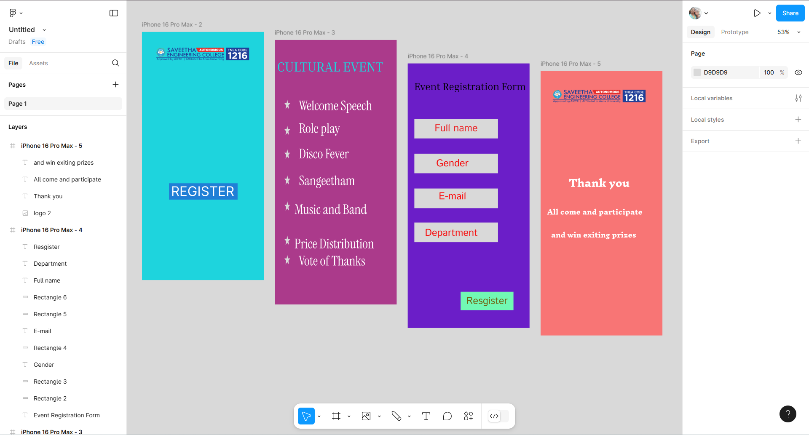

# Ex09 Event Registration Web Application
## Date: 19-05-2025

## AIM:
To design, develop and deploy a web application for event registration.

## DESIGN STEPS:

### Step 1:
Create a new frame.

### Step 2:
Select any one preset size of your choice.

### Step 3:
Select the shapes you need.

### Step 4:
Import images as needed.

### Step 5:
Create pages based on your need and link them.

### Step 6:

Validate the HTML and CSS code.

### Step 6:

Publish the website in the given URL.

## DESIGN TOOL:
Figma

## CODE:
```
html code
<div class="container--0-">
  <svg
    width="249"
    height="59"
    viewBox="0 0 249 59"
    fill="none"
    xmlns="http://www.w3.org/2000/svg"
  >
    <path d="M0.5 0H248.5V59H0.5V0Z" fill="#2222CE" fill-opacity="0.48"></path>
  </svg>
  <div class="text-0-1-2">REGISTER</div>
</div>
<div class="container--0-">
  <div class="text-0-1-0">CULTURAL EVENT</div>
  <svg
    width="22"
    height="36"
    viewBox="0 0 22 36"
    fill="none"
    xmlns="http://www.w3.org/2000/svg"
  >
    <path
      d="M11 0L13.4697 13.4742H21.4616L14.996 21.8017L17.4656 35.2758L11 26.9483L4.53436 35.2758L7.00402 21.8017L0.538379 13.4742H8.53035L11 0Z"
      fill="#D9D9D9"
    ></path></svg
  ><svg
    width="22"
    height="36"
    viewBox="0 0 22 36"
    fill="none"
    xmlns="http://www.w3.org/2000/svg"
  >
    <path
      d="M11 0L13.4697 13.4742H21.4616L14.996 21.8017L17.4656 35.2758L11 26.9483L4.53436 35.2758L7.00402 21.8017L0.538379 13.4742H8.53035L11 0Z"
      fill="#D9D9D9"
    ></path></svg
  ><svg
    width="22"
    height="36"
    viewBox="0 0 22 36"
    fill="none"
    xmlns="http://www.w3.org/2000/svg"
  >
    <path
      d="M11 0L13.4697 13.4742H21.4616L14.996 21.8017L17.4656 35.2758L11 26.9483L4.53436 35.2758L7.00402 21.8017L0.538379 13.4742H8.53035L11 0Z"
      fill="#D9D9D9"
    ></path></svg
  ><svg
    width="22"
    height="36"
    viewBox="0 0 22 36"
    fill="none"
    xmlns="http://www.w3.org/2000/svg"
  >
    <path
      d="M11 0L13.4697 13.4742H21.4616L14.996 21.8017L17.4656 35.2758L11 26.9483L4.53436 35.2758L7.00402 21.8017L0.538379 13.4742H8.53035L11 0Z"
      fill="#D9D9D9"
    ></path></svg
  ><svg
    width="22"
    height="36"
    viewBox="0 0 22 36"
    fill="none"
    xmlns="http://www.w3.org/2000/svg"
  >
    <path
      d="M11 0L13.4697 13.4742H21.4616L14.996 21.8017L17.4656 35.2758L11 26.9483L4.53436 35.2758L7.00402 21.8017L0.538379 13.4742H8.53035L11 0Z"
      fill="#D9D9D9"
    ></path></svg
  ><svg
    width="22"
    height="36"
    viewBox="0 0 22 36"
    fill="none"
    xmlns="http://www.w3.org/2000/svg"
  >
    <path
      d="M11 0L13.4697 13.4742H21.4616L14.996 21.8017L17.4656 35.2758L11 26.9483L4.53436 35.2758L7.00402 21.8017L0.538379 13.4742H8.53035L11 0Z"
      fill="#D9D9D9"
    ></path></svg
  ><svg
    width="22"
    height="36"
    viewBox="0 0 22 36"
    fill="none"
    xmlns="http://www.w3.org/2000/svg"
  >
    <path
      d="M11 0L13.4697 13.4742H21.4616L14.996 21.8017L17.4656 35.2758L11 26.9483L4.53436 35.2758L7.00402 21.8017L0.538379 13.4742H8.53035L11 0Z"
      fill="#D9D9D9"
    ></path>
  </svg>
  <div class="text-0-1-8">Welcome Speech</div>
  <div class="text-0-1-9">Vote of Thanks<br /></div>
  <div class="text-0-1-10">Role play<br /></div>
  <div class="text-0-1-11">Disco Fever<br /></div>
  <div class="text-0-1-12">Sangeetham<br /></div>
  <div class="text-0-1-13">Music and Band<br /><br />Price Distribution</div>
</div>
<div class="container--0-">
  <div class="text-0-1-0">Event Registration Form<br /></div>
  <svg
    width="302"
    height="71"
    viewBox="0 0 302 71"
    fill="none"
    xmlns="http://www.w3.org/2000/svg"
  >
    <rect width="302" height="71" fill="#D9D9D9"></rect></svg
  ><svg
    width="302"
    height="71"
    viewBox="0 0 302 71"
    fill="none"
    xmlns="http://www.w3.org/2000/svg"
  >
    <rect width="302" height="71" fill="#D9D9D9"></rect>
  </svg>
  <div class="text-0-1-3">Gender<br /></div>
  <svg
    width="302"
    height="71"
    viewBox="0 0 302 71"
    fill="none"
    xmlns="http://www.w3.org/2000/svg"
  >
    <rect width="302" height="71" fill="#D9D9D9"></rect>
  </svg>
  <div class="text-0-1-5">E-mail<br /></div>
  <svg
    width="302"
    height="71"
    viewBox="0 0 302 71"
    fill="none"
    xmlns="http://www.w3.org/2000/svg"
  >
    <rect width="302" height="71" fill="#D9D9D9"></rect></svg
  ><svg
    width="191"
    height="67"
    viewBox="0 0 191 67"
    fill="none"
    xmlns="http://www.w3.org/2000/svg"
  >
    <rect width="191" height="67" fill="#71F8B4"></rect>
  </svg>
  <div class="text-0-1-8">Full name</div>
  <div class="text-0-1-9">Department<br /></div>
  <div class="text-0-1-10">Resgister</div>
</div>
<div class="container--0-">
  
  <div class="text-0-1-1">Thank you<br /></div>
  <div class="text-0-1-2">All come and participate<br /></div>
  <div class="text-0-1-3">and win exiting prizes<br /></div>
</div>


css code
.container--0- {
  position: absolute;
  left: 1700px;
  top: -513px;
  width: 440px;
  height: 956px;
  background-color: #f87575;
  justify-content: start;
  align-items: start;
}
.text-0-1-2 {
  width: 346px;
  height: 124px;
  color: #ffffff;
  font-size: 24px;
  font-family: Inknut Antiqua, "ExtraBold";
  font-weight: 800;
  text-align: left;
  vertical-align: top;
}
.text-0-1-0 {
  width: 460px;
  height: 120px;
  color: #000000;
  font-size: 36px;
  font-family: Inria Serif, "Regular";
  font-weight: 400;
  text-align: left;
  vertical-align: top;
}
.text-0-1-8 {
  width: 156px;
  height: 52px;
  color: #ea282b;
  font-size: 36px;
  font-family: Istok Web, "Regular";
  font-weight: 400;
  text-align: left;
  vertical-align: top;
}
.text-0-1-9 {
  width: 191px;
  height: 104px;
  color: #f61515;
  font-size: 36px;
  font-family: Istok Web, "Regular";
  font-weight: 400;
  text-align: left;
  vertical-align: top;
}
.text-0-1-10 {
  width: 151px;
  height: 52px;
  color: #716514;
  font-size: 36px;
  font-family: Istok Web, "Regular";
  font-weight: 400;
  text-align: left;
  vertical-align: top;
}
.text-0-1-11 {
  width: 180px;
  height: 124px;
  color: #ffffff;
  font-size: 48px;
  font-family: Instrument Serif, "Regular";
  font-weight: 400;
  text-align: left;
  vertical-align: top;
}
.text-0-1-12 {
  width: 203px;
  height: 124px;
  color: #ffffff;
  font-size: 48px;
  font-family: Instrument Serif, "Regular";
  font-weight: 400;
  text-align: left;
  vertical-align: top;
}
.text-0-1-13 {
  width: 293px;
  height: 171px;
  color: #ffffff;
  font-size: 48px;
  font-family: Instrument Serif, "Regular";
  font-weight: 400;
  text-align: left;
  vertical-align: top;
}
.text-0-1-3 {
  width: 307px;
  height: 124px;
  color: #ffffff;
  font-size: 24px;
  font-family: Inknut Antiqua, "ExtraBold";
  font-weight: 800;
  text-align: left;
  vertical-align: top;
}
.text-0-1-5 {
  width: 99px;
  height: 104px;
  color: #fe0a0a;
  font-size: 36px;
  font-family: Istok Web, "Regular";
  font-weight: 400;
  text-align: left;
  vertical-align: top;
}
.text-0-1-1 {
  width: 220px;
  height: 186px;
  color: #ffffff;
  font-size: 36px;
  font-family: Inknut Antiqua, "ExtraBold";
  font-weight: 800;
  text-align: left;
  vertical-align: top;
}
```

## OUTPUT:


## RESULT:
The program to design, develop and deploy a web application for event registration is completed successfully.
